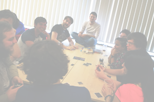
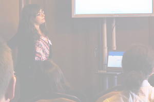

&nbsp;<a href="http://feeds.feedburner.com/rdgain" rel="alternate" type="application/rss+xml">Subscribe in a reader</a> for work updates and new [blog](blog) posts.

<table style="width:100%;border-spacing: 10px; border-collapse: separate;"  cellpadding="5">
<tr>
<td>

  
  <a href="about">About</a>

</td>
<td>

  
  <a href="research">Research</a>

</td>
<td>

  
  <a href="publications">Publications</a>

</td>
</tr>
<tr>
<td>

  
  <a href="events">Events</a>

</td>
<td>

  
  <a href="teaching">Teaching</a>

</td>
<td>

  
  <a href="projects">Projects</a>

</td>
</tr>
<tr>
<td colspan="3">

  
  <a href="blog">Blog</a>

</td>
</tr>
</table>

     

